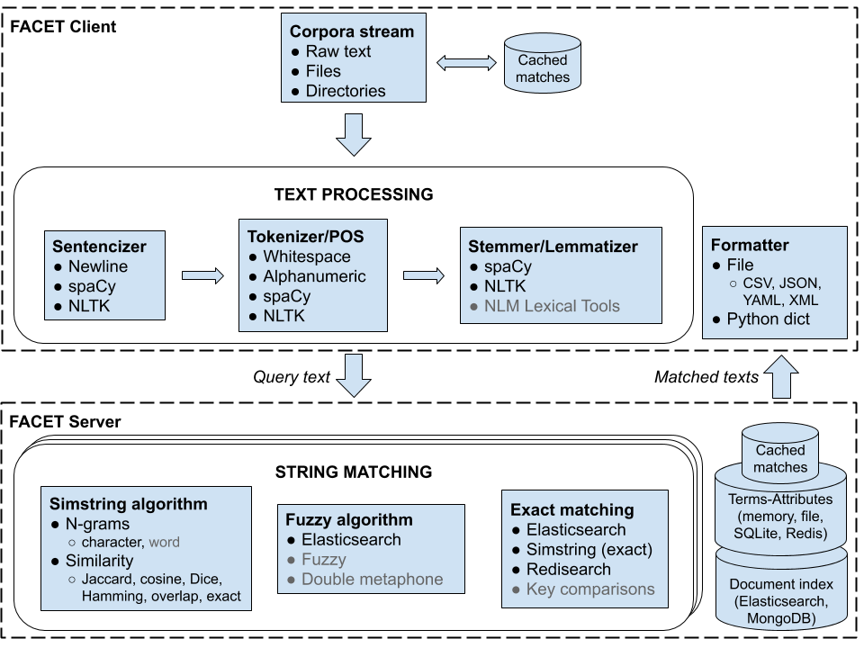

.. .. image:: https://codecov.io/gh/kbrown42/quickerumls/branch/master/graph/badge.svg
   :target: https://codecov.io/gh/edponce/quickerumls
   :alt: Coverage Status

.. .. image:: https://readthedocs.org/projects/quickerumls/badge/?version=latest
   :target: https://quickerumls.readthedocs.io/en/latest/?badge=latest
   :alt: Documentation Status

.. .. image:: https://img.shields.io/badge/license-MIT-blue.svg
   :target: https://github.com/edponce/smarttimers/blob/master/LICENSE
   :alt: License

|

FACET - Framework for Annotation and Concept Extraction in Text
===============================================================

FACET is an extension of `QuickUMLS`_ and `SimstringPure`_ tools providing
faster, scalable, and flexible concept extraction from medical narratives.
Uses the simple and efficient CP-Merge approach of `Simstring`_ algorithm.

.. _QuickUMLS: https://github.com/Georgetown-IR-Lab/QuickUMLS
.. _SimstringPure: https://pypi.org/project/simstring-pure
.. _Simstring: http://www.chokkan.org/software/simstring

Features
--------

* Simple configuration and easy to use
* Multiple modes of operation
* Multiple database backends
* Multiprocessing for processing corpi
* Easy to scale up, run locally, or containerize
* Stores extracted annotations in serializable and/or human-readable formats

.. .. figure:: figures/FACET.png

Setup and Installation
----------------------

1. Clone repository ::

    $ git clone https://github.com/edponce/FACET.git
    $ cd FACET/

2. Install package::

    $ pip install .

3. (Optional) Configure FACET shell command::

    $ source scripts/shell_completion.sh

4. (Optional) Install spaCy language model, see `spaCy models`_::

    $ sh scripts/setup_spacy.sh

.. _spaCy models: https://spacy.io/models/en

5. (Optional) Install NLTK NLP components::

    $ python scripts/setup_nltk.py

6. (Optional) Install UMLS files:

   You require to have a valid UMLS installation on disk. To use UMLS files,
   you must first obtain a `UMLS license`_ from the National Library of
   Medicine, then download the corresponding `UMLS`_ files. Currently, FACET in
   UMLS mode supports the *MRCONSO.RRF* and (optional) *MRSTY.RRF* files. Note
   that `UMLS`_ provides *MRCONSO.RRF* as a single downloadable item.

   For running examples, create a symbolic link of UMLS directory in FACET path::

    $ ln -s YOUR_UMLS_FULLPATH/ data/umls

.. _UMLS license: https://uts.nlm.nih.gov/license.html
.. _UMLS: https://www.nlm.nih.gov/research/umls/licensedcontent/umlsknowledgesources.html

7. Run tests ::

    $ tox

8. (Optional) Check command line interface ::

    $ python facet/scripts/cli.py --help
    $ python facet/scripts/cli.py run --help
    $ python facet/scripts/cli.py server --help
    $ python facet/scripts/cli.py client --help

    or (if shell_completion.sh installed)

    $ facet --help
    $ facet run --help
    $ facet server --help
    $ facet client --help

Usage
-----

FACET can be used in different modes as it functions as an application, a
command line tool, or a library.

* Run REPL on command line ::

    $ facet run --install data/install/american-english
    $ > cancer
    $ > alphametic
    $ > exit()

* Process file via command line ::

    $ facet run --install data/install/american-english --query data/sample.txt --formatter json --output annotations.json

* Run with a configuration file::

    $ facet run --config config/auto.yaml
    $ <viewer> annotations.json

* Run as a web service ::

    $ facet server --install data/install/american-english --host localhost --port 4444
    $ facet client --host localhost --port 4444 --formatter json
    $ > acetate
    $ > exit()
    $ facet server-shutdown --host localhost --port 4444

* Run programmatically using Python's API (see example scripts) ::

    $ <viewer> examples/install.py
    $ <viewer> examples/match.py

Databases Initialization
------------------------

FACET supports the following databases for backend storage, and due to its modular
structure different database types can be used in the same installation.

* Python dictionary (in-memory) - fast performance, but increases main process storage and does not persists after system shutdown
* Python dictionary (file backed) - fast performance, but increases main process storage. Persists after system shutdown.
* Python SQLite3 (in-memory, file backed) - medium performance
* Redis - medium performance.

Performance
===========

UMLS 2018-AA with selected semantic types: 4,532,193 concepts
Semantic types: 1,782,484
Simstring (character features with n=3): 7,000,905 entries

============================ ===========
Task (in-memory dict)        Runtime (s)
============================ ===========
Load/parse semantic types    7.16
Write semantic types         1.06
Load/parse concepts          41.69
Write concepts and Simstring 615.87
Total time                   665.79
============================ ===========

UMLS Related Tools
==================

* QuickUMLS: https://github.com/Georgetown-IR-Lab/QuickUMLS
* py-umls: https://github.com/chb/py-umls
* UMLS Description:

  * http://text-analytics101.rxnlp.com/2013/11/what-tui-cui-lui-you-silly-sui.html
  * https://www.microsoft.com/en-us/research/wp-content/uploads/2016/02/tr-2001-108.pdf

Coming Soon
===========

Matchers with fuzzy string matching:

* fuzzywuzzy
